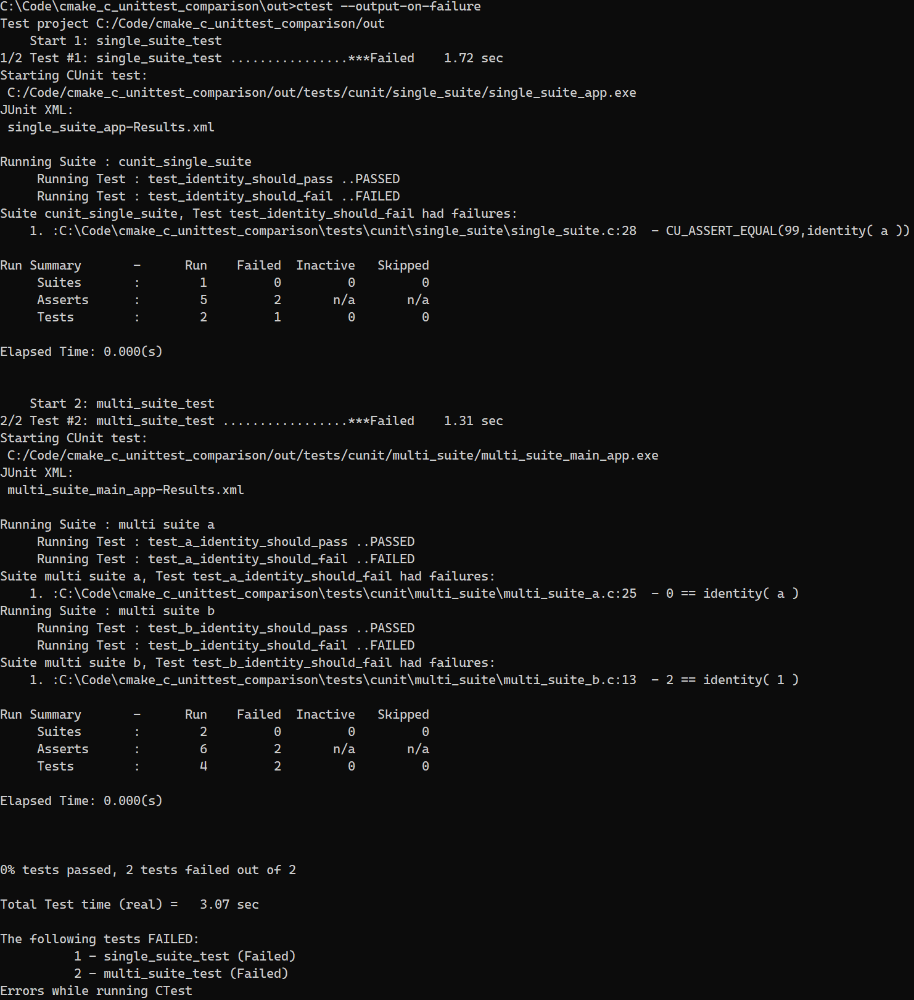
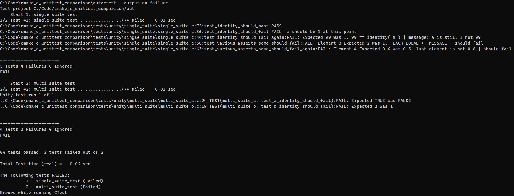
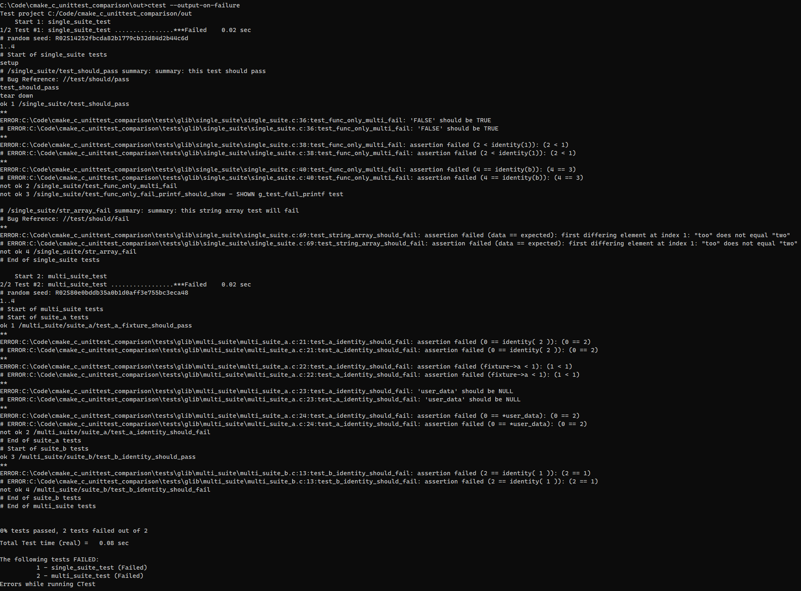

# C Unit Test Comparison with CMake

Comparison of C language unit testing frameworks with CMake (CUnit, Unity, cmocka etc)

## 1. Purpose

I'm on the search for a simple unit testing framework for pure C. Some frameworks are more popular and are mentioned in many forum discussions, such as Unity / Ceedling, CUnit, cmocka, but there are plenty other less known ones that could be just as good. I'm looking for one that has informative output, is easy to build / integrate, is easy to learn (no lengthy documentation), and is actively maintained and can be expected to be around for a while (good history, adaptation, number of maintainers). It's all going to be quite superficial, first-impressions level, because I want to have a good idea which system is worth investing more energy into before digging any deeper.

Right now, mocking is not yet in my focus, so that will not be considered.

C++ frameworks are excluded (google test, boost test, cppunit and alike) even if they're supposed to work well with C. No mixed code for me.

Tests are mostly run via CMake's `ctest` utility. I'm sure there are advantages running tests in other ways, e.g. more integrated into IDEs, but for now I prefer this simple command-line approach.

This is, obviously, a work in progress.

## 2. List of Candidates

1. [cmocka](https://cmocka.org/)
2. [µnit (munit)](https://nemequ.github.io/munit/)
3. [ctest](https://github.com/bvdberg/ctest) (not the one included in CMake)
4. [Cgreen](https://github.com/cgreen-devs/cgreen)
5. [Criterion](https://github.com/Snaipe/Criterion/)
6. [tau](https://github.com/jasmcaus/tau/)
7. [libcester](https://github.com/exoticlibraries/libcester)

## 3. Impressions

### 3.1 Cunit (Cunity fork)

**Websites**:

- fork homepage: <https://cunity.gitlab.io/cunit/>
- fork repo: <https://gitlab.com/cunity/cunit/-/tree/master/>
- original home: <https://cunit.sourceforge.net/example.html>

**Activity and Maintainers**: single developer; repo inactive; besides a recent version bump, last commit was >1 year ago.

**Documentation**: pre-fork CUnit has detailed docs; the new fork's docs don't go much beyond simple usage with the new CUnitCI API.

**Ease of use**: new CUnitCI macros are easy to learn and use for simple use cases; pre-fork API can do much more but is quite complex in return.

**CMake integration**: very easy, project comes with own CMakeFile.txt; no special build dependencies

```CMake
    set(CUNIT_DISABLE_EXAMPLES yes)
    set(CUNIT_DISABLE_TESTS yes)

    add_subdirectory(cunit/CUnit)
```

**General Features**: sufficient; fairly good organisation of tests (suites, registry), not so versatile in terms of smart asserts

- [x] tests can be organised into suites, which can added to a registry to be run together
- [x] each suite can have their own suite-level and pre-test setup / teardown functions
- [x] test context shared via global variables
- [x] easy to use with one executable / test code file  (see [single_suite](tests/cunit/single_suite/) example)
- [x] multiple tests / suites can be linked into one executable (though this isn't well documented, see [multi_suite](tests/cunit/multi_suite/) example);
- [ ] no individual test timing

**Asserts**:

- [x] distinguishes between fatal and non-fatal assertions, allowing multiple asserts in one test (however, only the last failure is reported on the command line - see comments on output)
- [ ] limited [selection of asserts](https://cunit.sourceforge.net/doc/writing_tests.html)
- [ ] no array-capable assertions

ASSERT, TRUE/FALSE, PASS/FAIL, [ - | PTR | STRING | NSTRING | DOUBLE ] [NOT] EQUAL

all (except PASS) have _FATAL and non-fatal variants

**Output**: terminal + JUnit XML

- [x] JUnit XML output
- [x] show executed code for failed tests
- [ ] cannot include custom messages in failed test output (unless using a trick like `condition && "message"` in assert)
- [ ] variable values not shown in failed tests



In my opinion, the output is well organised and it's easy to understand what failed. It's good that the failing code is shown. This type of static output isn't suitable for some things, though. For example, when looping over an array and testing each element with an assert, how to show which element is incorrect? Unity has asserts for comparing arrays, and shows the index and value of the incorrect element.

In case of multiple failing assertions in one test, only the last one's code is reported to the command line: only `CU_ASSERT_EQUAL( 99, identity( a ) )` is shown for `single_suite` above. However,the summary also indicates the correct number and the XML output for `single_suite` shows both failed asserts:

```xml
<?xml version="1.0" encoding="UTF-8"?>
<testsuites errors="0" failures="1" tests="4" name="single_suite_app-Results.xml" time="0.000000">
  <testsuite errors="0" failures="1" tests="4" name="cunit_single_suite" time="0.000000">
    <testcase classname="CUnit.cunit_single_suite" name="CUnit Suite init" time="0.000000">
    </testcase>
    <testcase classname="CUnit.cunit_single_suite" name="test_identity_should_pass" time="0.000000">
    </testcase>
    <testcase classname="CUnit.cunit_single_suite" name="test_identity_should_fail" time="0.000000">
      <failure>Function:
File: C:\Code\cmake_c_unittest_comparison\tests\cunit\single_suite\single_suite.c
Line: 27
Assertion Failed:
Condition: '0 == identity( a )'

</failure>
      <failure>Function:
File: C:\Code\cmake_c_unittest_comparison\tests\cunit\single_suite\single_suite.c
Line: 28
Assertion Failed:
Condition: 'CU_ASSERT_EQUAL(99,identity( a ))'

</failure>
    </testcase>
    <testcase classname="CUnit.cunit_single_suite" name="CUnit Suite cleanup" time="0.000000">
    </testcase>
  </testsuite>
</testsuites>
```

### 3.2 Unity

**Websites**:

- home: <http://www.throwtheswitch.org/unity>
- repo: <https://github.com/ThrowTheSwitch/Unity>

**Activity and Maintainers**: 100+ contributors, though only 1 contributor has committed code in 2023 (as of April 2023). The last bugfix release was in 2021 Jan; last feature release in 2019 Oct; main maintainer [claims](https://groups.google.com/g/throwtheswitch/c/JKg9GgdeYHw) that development is active and going mostly in the direction of Ceedling and such, and the forums are pretty active too.

**Documentation**: the docs describe a simple use case and that part is easy to understand, easy to implement and integrate. However, there'a lot beyond that that's hidden in the code and examples. For example, the only references on `unity_fixtures` are comments in the source and the [2nd example](https://github.com/ThrowTheSwitch/Unity/tree/master/examples/example_2). While it may not meant to be the main way to use Unity, it should be better documented if it exists. Also, some configuration options that are documented and are supposed to change the output (e.g. `UNITY_OUTPUT_FOR_ECLIPSE`) don't seem to be doing anything.

**Ease of use**: easy; there's a "general" mode that suits 1 exe / code file, and a "fixture" mode with test group functionality; both modes are fairly simple to use... with exceptions in the latter due to lack of docs. On the other hand, a lot of additional functionality is provided by _Ruby_ scripts (e.g. test generators), which is unfortunate as I don't want to use _Ruby_.

**CMake integration**: the project includes `CMakeLists.txt` scripts as well, and there are some instructions on how to include it as a simple source file.

```CMake
    set(UNITY_EXTENSION_FIXTURE yes CACHE BOOL "compile unity with fixtures extension")

    add_subdirectory(unity)
```

Got a lot of warnings, though, when I actually included `unit_fixture` in the build.

**General Features**:

- [x] general usage of one test executable / file
- [x] `setUp` and `tearDown` functions run before each test; context shared via global variables
- [x] `unity_fixtures` can handle test groups; enables collecting tests from multiple files, and group-specific setup/teardown functions

**Asserts**: [list](https://github.com/ThrowTheSwitch/Unity/blob/master/docs/UnityAssertionsReference.md)

- [x] large variety of type-specific asserts (TRUE/FALSE, NULL, INT*, UINT*, HEX*, FLOAT, DOUBLE)
- [x] `_ARRAY` and `_EACH_EQUAL` variants to compare arrays
- [x] `_MESSAGE` variants to display custom message
- [x] [NOT] WITHIN, LESS / GREATER, NEG variants for bounds checking
- [x] BITS for bitmasks

**Output**:

- [ ] only command-line output
- [ ] doesn't show executed code for failed tests
- [x] can include custom messages in output (`_MESSAGE` variants)
- [x] variable values shown in specific tests
- [ ] inconsistent output between `unity` and `unity_fixture`



In my opinion, output from Unity is in some ways better, in other ways less informative than CUnit's. It's good that custom messages can be included, and that, for specific tests, actual values are shown (i.e. `2` instead of `identity (a)`), however, these outputs lack context without at least showing the executed code inside the assert. For example, `Expected TRUE was FALSE` (see `multi_suite_a/test_a_identity_should_fail`) is useless information unless a custom message is included or one looks up the failing source code. Having to add meaningful custom messages to _each_ test isn't ideal. At least showing the code would help a bit. This is actually possible with custom macros that add a text version of the code (`#code`) to the custom message (see `TEST_ASSERT_EQUAL_INT_M` and `TEST_ASSERT_EQUAL_INT_MESSAGE_M` in `single_suite.c`) but, again, this requires extra work. Related Ruby scripts might offer better output, but I don't want to use Ruby.

I also find CUnit's output easier to read. For example, it only shows the full path to the source file for failing tests. Passing tests are only listed by test name. And as mentioned, the XML output from CUnit includes all the failing asserts within a test, so it's possible (even if not always practical) to have several non-fatal asserts in one test. That doesn't work with Unity (see `..._again` tests to actually get those tests to execute).

Furthermore, the output is not consistent between `unity` and `unity_fixture`. The latter only listed failing tests; passing tests were not shown (e.g. `test_a_identity_should_pass`), whereas the former listed the passing test as well. Maybe there's a setting somewhere? I didn't see that in the docs.

### GLib

**Websites**:

- home: <https://docs.gtk.org/glib/testing.html>
- repo: <https://gitlab.gnome.org/GNOME/glib>

**Activity and Maintainers**: active; GLib has a big community

**Documentation**: pretty good, same as GLib

**Ease of use**: depends - it's easy to create and register tests, set up fixtures. On the other hand, I wasn't able to get subprocess _traps_ to work on Windows. First it errored out telling me that some kind of _helper_ was missing, of which I found no mentions in the docs whatsoever. Digged up some related topics online that hinted at the existence of a helper executable on Windows. I was able to acquire `gspawn-win64-helper.exe` and `gspawn-win64-helper.exe` from a Gimp installation, but even with those present the test threw an error that it couldn't read from the subprocess's pipe. Again, not much information online how to solve that. I assume that a proper installation (build) of GLib would not have this issue(?), but I'd decided not to bother with that so I gave up and commented `test_trap_failure_and_stdout` out.

**CMake integration**: More complex than Unity and CUnit, definitely. First of all, on Windows, it's not trivial to get GLib _without_ building it inside the likes of `MSYS2` and without `pkg-config`, both of which I decided not to install in the name of simplicity. Luckily, I use `Gstreamer` anyway, which includes compiled GLib libraries, at least enough for basic functionality. As mentioned above, I wasn't able to get subprocess _traps_ to work, even with a _helper_ executable copied from a Gimp installation. While GLib doesn't provide documentation for CMake (only Meson and Autotools), it wasn't very difficult to set CMake up: instead of configuring with `pkg-config`, though, include and lib directories were added manually.

**General Features**:

- [x] test hierarchy is defined with a "path" (e.g. "/suite_a/test_group_a/test_a"), which allows easy and clear organisation
- [x] grouping tests into suites, groups using paths is part of basic functionality, nothing special required for multi-suite tests
- [x] unlike Unity and CUnit, fixtures are not global variables but dynamically allocated types set up and torn down for each test; GLib takes care of allocation and freeing
- [x] tests can receive fixture data and "global" user data
- [x] multiple test registration functions covering different levels of complexity (no data, only user data, user data with cleanup, full with fixture and user data)
- [x] _trap_ functionality to run tests that can abort / not return in a subprocess; I couldn't get this to work, though!
- [x] extras: bug URI association, timer, teardown queue, test summary, log handling, etc.

**Asserts**:

- [x] failures can be non-fatal optionally (per executable option)
- [x] standard set of type-specific asserts (TRUE/FALSE, NULL, float, (u)int, hex, str)
- [x] some GLib-specific asserts (error, variant)
- [x] assert for comparison of NULL-terminated string arrays
- [x] memory comparison
- [ ] no other array types supported
- [ ] no range checking assert variants
- [ ] no asserts for bit masks

**Output**:

- [x] shows executed code for failed tests
- [x] variable values shown in specific tests
- [ ] no custom messages for failed asserts
- [x] bug URI and test summary messages (always shown)
- [x] custom messages possible with `g_test_fail_printf` and `g_test_incomplete_printf`, but these don't coordinate with the asserts; in fact, the messages aren't displayed in the same test that has failing asserts (see `test_func_only_multi_fail` in [single_suite.c](tests/glib/single_suite/single_suite.c))



The output follows the TAP format. I haven't found a way to switch to a different format. For command line reading, TAP's structure is sub-optimal. I'm happy with the information shown, however, the `ok` or `not ok` lines, and test boundaries in general are difficult to spot, as one's attention is overwhelmed by the long and duplicated error lines. The duplication is due to those lines being sent to both stdout and stderr. While it's possible to reduce the clutter by redirecting one, I'm not sure how to do that with CTest, so the clutter remains.

GLib Test is a versatile, easy-to-use test framework, which, compared to Unity and CUnit seems to have the best feature set. On the other hand, it's not as easy to build/integrate, unless you're already using GLib for the project.
